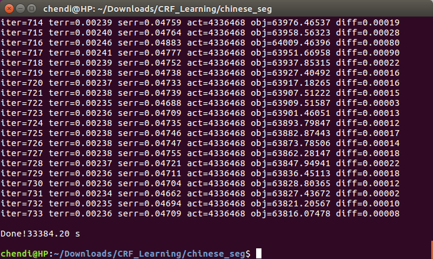

# 利用CRF条件随机场进行中文分词
使用Bakeoff 2005微软亚洲研究院提供的中文分词语料进行训练，公开的数据在[这里](http://sighan.cs.uchicago.edu/bakeoff2005/)。在[我爱自然语言](http://www.52nlp.cn/%E4%B8%AD%E6%96%87%E5%88%86%E8%AF%8D%E5%85%A5%E9%97%A8%E4%B9%8B%E5%AD%97%E6%A0%87%E6%B3%A8%E6%B3%954)上看到了这篇文章，自己动手进行了实践，使用CRF++ 0.58工具，训练大约用了2个多小时，最终在Bakeoff 2005数据集上测试，准确率0.964，召回率0.965。对内容不理解请移步上面的链接，感谢作者提供的精彩内容及程序文件。crf_model文件训练的时间较长，大小在50MB左右，有需要的请发送邮件给我。
## 一.准备工作 
请下载上面的数据集icwb2-data.zip，在系统中安装CRF++ 0.58。
## 二、数据格式处理
在文件夹/icwb2-data/training/找到msr_training.utf8，运行programs中提供的```Make_crf_train_data.py```，将数据变成Crf所读取的格式。
## 三、开始训练
在终端中输入```crf_learn -f 3 -c 4.0 template msr_training.tagging4crf.utf8 crf_model```，此命令将进行训练。重要说明：template存在于CRF++文件夹example/seg/中，msr_training.tagging4crf.utf8是上一步我们产出的文件，训练结束后会生成crf_model模型文件。
## 四、测试文件
原始的测试文件在icwb2-data/testing/msr_test.utf8中，利用programs中提供的```Make_crf_test_data.py```将测试文件转换为crf格式。使用命令```crf_test -m crf_model msr_test4crf.utf8 > msr_test4crf.tag.utf8```来对测试文件进行标注。crf_model为训练生成的模型文件，msr_test4crf.utf8为转换格式后的测试文件，msr_test4crf.tag.utf8为标注后的测试文件。标注后我们还需要将crf格式的测试文件转换为分词后的文本，方便后面进行准确率和召回率的测试。运行programs中crf_data_2_word.py文件，执行```python crf_data_2_word.py msr_test4crf.tag.utf8 msr_test4crf.tag2word.utf8```即可得到合并后的分词结果文件 msr_test4crf.tag2word.utf8。
## 五、分词效果评判
现在可以利用bakeoff2005提供的测试脚本来进行评判了，需要准备多个文件。 
前面三个文件在/icwb2-data压缩文件包中，后面的我们前面得到的分词结果文件。
* /icwb2-data/scripts/score 
* /icwb2-data/gold/msr_training_words.utf8
* /icwb2-data/gold/msr_test_gold.utf8 
* msr_test4crf.tag2word.utf8

执行```./score msr_training_words.utf8 msr_test_gold.utf8 msr_test4crf.tag2word.utf8 > msr_crf_segment.score```  
## 六、查看结果
打开msr_crf_segment.score，文件最后将有最终的结果。 
>=== SUMMARY:  
=== TOTAL INSERTIONS:	1419  
=== TOTAL DELETIONS:	1285  
=== TOTAL SUBSTITUTIONS:	2440  
=== TOTAL NCHANGE:	5144  
=== TOTAL TRUE WORD COUNT:	106873  
=== TOTAL TEST WORD COUNT:	107007  
=== TOTAL TRUE WORDS RECALL:	0.965  
=== TOTAL TEST WORDS PRECISION:	0.964  
=== F MEASURE:	0.965  
=== OOV Rate:	0.026  
=== OOV Recall Rate:	0.649  
=== IV Recall Rate:	0.974  

